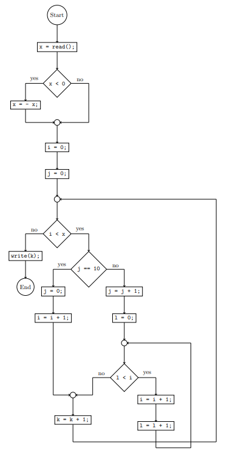

# miniJavaToTikz
miniJavaToTikz is a program converting programs in miniJava-syntax to control flow diagrams represented by tikzpictures.

# Usage
Compile `miniJavaToTikz.hs` with `ghc`, and then run the program with
```
miniJavaToTikz <filename>
```
`<filename>` is a string pointing to a miniJava-file, e.g. `example.miniJava`. The output will be saved into `<filename>.tex`, e.g. `example.miniJava.tex`.

## Example
The file [example.miniJava](example.miniJava) contains an example for a miniJava-program. The output looks as follows:



Some manual adjustments might be required afterwards.

## miniJava-Syntax
miniJava programs accepted are roughly of the following structure:
```
<Statement> ::=
        <Read>
        | <Write>
        | <Assign>
        | <If>
        | <IfElse>
        | <While>
        | <Statement> <Statement>
<Read> ::= <VarName> = read();
<Write> ::= write(<VarName>);
<Assign> ::= <VarName> = <Expression>;
<If> ::= if (<Condition>) { <Statement> };
<IfElse> ::= if (<Condition>) { <Statement> } else { <Statement> };
<While> ::= while (<Condition>) { <Statement> };
```
`<Condition>`, `<Expression>` and `<VarName>` are currently just strings not containing `{, }, ;`.